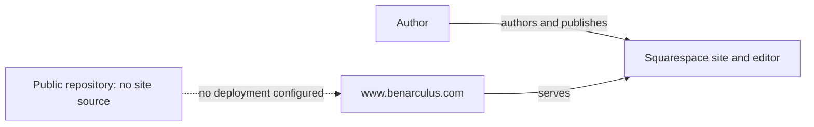
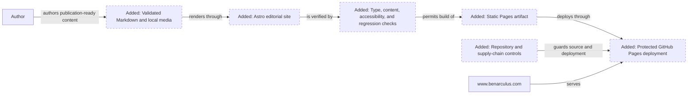
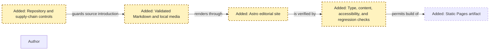
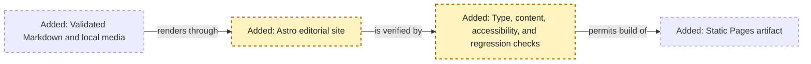
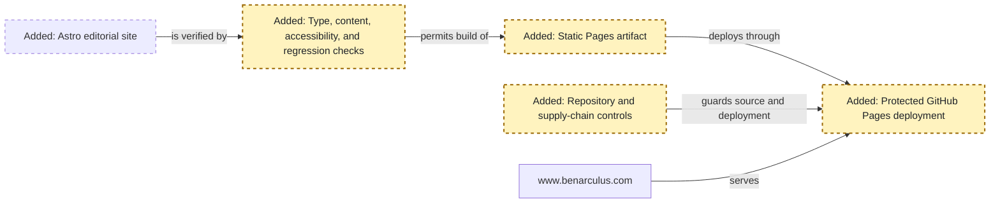
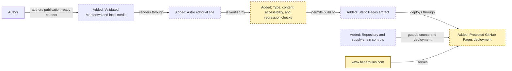

<!-- markdownlint-disable-file -->
# RPI Plan: Blog migration

## Task Metadata

* Task ID: BLOG-MIGRATION-001
* Task slug: blog-migration
* Plan date: 2026-09-16

## Executive Summary

* Bottom line: Plan a greenfield Astro blog in `benarculus/benarculus` that preserves the current public URLs and article metadata, upgrades the visual design, stores posts as validated Markdown, deploys safely to GitHub Pages, provides standard repository policies, and supports a controlled Squarespace cutover.
* Why this matters: The implementation must improve ownership and presentation without losing discoverability, content, assets, accessibility, or control of `www.benarculus.com`.
* Planning result: Complete and implementation-ready after the standard critique. All critique findings were resolved without changing the confirmed Astro, GitHub Pages, Markdown, public-repository, URL, or visual direction.
* Confidence and uncertainty: High confidence in the selected architecture, sequence, and security controls. Exact visual tokens and the owner-side inventory of private or unindexed Squarespace material remain implementation inputs; the legacy `/blog?format=rss` feed URL cannot be preserved on static GitHub Pages and is an accepted compatibility limitation.

### What You May Not Know

* The repository is currently greenfield, so the implementation must establish the application, content contract, quality checks, deployment, and repository safeguards together.
* The visible migration inventory is small, but Squarespace exports are incomplete; cancellation must wait until owner-side content and asset checks are complete.
* The repository currently has permissive Actions defaults, no ruleset, and disabled secret-scanning controls, so repository hardening is part of the migration rather than optional follow-up.
* Before the custom domain is attached, this repository publishes as a project site under `/benarculus/`; the plan therefore requires separate preview and production origin/base configurations.
* The current query-string feed URL `/blog?format=rss` cannot be preserved by GitHub Pages. The new canonical feed is `/rss.xml`, with visible and metadata-based discovery.
* Routine Dependabot updates are intentionally delayed and grouped to reduce both update noise and exposure to newly published releases; security fixes bypass that delay and remain individually reviewable.

## Phase Checklist

### Before

### After

The migration replaces the hosted Squarespace editor/runtime with repository-owned Markdown, a static Astro presentation layer, automated verification, and a narrowly privileged GitHub Pages deployment while retaining the public domain and known URLs.

<!-- rpi:phase id=P01 -->
### [x] P01: Secure and establish the Astro foundation

Goals:
* Correct the public repository's preventive security defaults before source is introduced, then establish a deterministic, typed static-site foundation and durable Markdown contract.

Dependencies:
* None

Highlighted work: enable preventive repository safeguards, then add the Astro application, validated content collection, deterministic package state, and foundational checks.

<!-- rpi:task id=P01-T01 -->
#### [x] P01-T01: Apply preventive repository safeguards

Goals:
* Protect the public repository from accidental secret disclosure and excessive workflow authority before application, content, media, or workflows are committed.

Requirements:
* NFR-004; NFR-006.
* Set default Actions workflow permissions to read-only and prevent Actions from approving pull requests.
* Enable available secret scanning and push protection before source migration begins; document any unavailable control and the compensating local or review check.
* Record the before/after repository settings in the implementation changes record without storing sensitive values.

Details:
* This settings-only prerequisite has no production-code dependency and must precede P01-T02 and P01-T03.
* Do not create deployment credentials or repository secrets for the blog.
* Required status checks and branch rules that depend on workflow names remain in P04-T03.

References:
* [.copilot-tracking/research/2026-09-16/blog-migration-research.md](../../research/2026-09-16/blog-migration-research.md):
  * C3 records the current permissive Actions and secret-protection posture.
  * W27, W31, and W41 define least privilege and preventive secret protection.

Dependencies:
* None

<!-- rpi:task id=P01-T02 -->
#### [x] P01-T02: Create the static Astro application

Goals:
* Make the repository build a typed, fully static Astro application locally and in automation.

Requirements:
* FR-001; NFR-002; NFR-003.
* Use a supported Astro and Node.js toolchain with strict TypeScript settings and a committed npm lockfile.
* The default render mode is static and the generated `dist/` directory is not committed.
* Package scripts expose one canonical command each for development, type/content checking, testing, production build, and preview.

Details:
* Scaffold the application at the repository root because the repository has no existing production source.
* Keep the dependency set narrow. Add only packages directly required for Astro, the selected official integrations, formatting/linting, and the tests named in this plan.
* Use `npm ci` in automation; local development may use the repository-standard npm workflow.

References:
* [.copilot-tracking/research/2026-09-16/blog-migration-research.md](../../research/2026-09-16/blog-migration-research.md):
  * “Astro is the strongest overall fit” and W3, W7, W8, W25 establish the application shape.
  * “Dependency compromise is a larger technical risk than the public source itself” and W39 establish the deterministic-install boundary.

Dependencies:
* P01-T01

<!-- rpi:task id=P01-T03 -->
#### [x] P01-T03: Define the Markdown content contract and stable routes

Goals:
* Ensure every published post has validated metadata and resolves through a stable `/blog/<slug>` URL without requiring MDX for ordinary writing.

Requirements:
* FR-002; FR-003; NFR-006; NFR-007.
* The post schema validates `title`, `description`, `publishedDate`, optional `updatedDate`, `author`, `heroImage`, `heroAlt`, `tags`, `draft`, and optional explicit `slug`.
* Draft entries are excluded from production collections, feeds, sitemaps, and static routes.
* `/blog` and `/blog/[slug]` are canonical routes; the existing article slug remains exact.
* Raw HTML and MDX are not enabled for normal posts; any later exception requires an explicit trusted component and dependency review.

Details:
* Keep post files and locally owned post media together under a predictable repository-owned content structure.
* The `draft` field is only for publication-ready content intentionally staged for a later trusted merge; unfinished or private writing must never be committed because public branches and pull requests are also publicly readable.
* Treat frontmatter as the canonical content metadata source used by page rendering, RSS, sitemap, social metadata, and structured data.
* Add focused schema and routing tests that fail on invalid frontmatter, duplicate slugs, or production inclusion of drafts.

References:
* [.copilot-tracking/research/2026-09-16/blog-migration-research.md](../../research/2026-09-16/blog-migration-research.md):
  * “The content contract should be plain Markdown first” defines the field set and MDX boundary.
  * W1, W8, W15, W16 establish stable URLs and validated collections.

Dependencies:
* P01-T02

<!-- rpi:task id=P01-T04 -->
#### [x] P01-T04: Establish repository-owned quality checks

Goals:
* Give contributors and later deployment jobs one repeatable validation surface for types, content, generated routes, and browser-visible regressions.

Requirements:
* FR-002; FR-003; FR-005; FR-007; NFR-001; NFR-002; NFR-003; NFR-009.
* The canonical local and CI check runs Astro type/content validation, unit tests with coverage enforcement, browser regression tests, and a production build.
* Unit tests cover content-schema validation, slug derivation and collision handling, draft exclusion, post sorting/filtering, canonical URL construction for preview and production bases, metadata/JSON-LD generation, RSS item generation, sitemap route selection, and any shared pure rendering helpers.
* Testable TypeScript/JavaScript modules maintain at least 90% line, statement, and function coverage and at least 85% branch coverage. Generated output, static content prose, type declarations, and configuration-only files are excluded only through reviewed explicit patterns.
* Playwright browser tests run against the built Astro preview in Chromium, Firefox, and WebKit and cover the home page, `/blog`, the preserved article route, navigation, keyboard focus visibility, 320-CSS-pixel reflow, and absence of unexpected client-side scripts.
* Test fixtures and assertions must not duplicate the complete migrated article body.

Details:
* Use focused unit or integration tests for content/schema helpers and Playwright Test for generated-page behavior.
* Keep business and publishing rules in testable modules rather than embedding them entirely in page templates. Use representative fixtures for valid posts, drafts, invalid metadata, duplicate slugs, missing optional fields, and preview-versus-production URL behavior.
* A passing build is not a substitute for passing unit tests. Any justified coverage exclusion or threshold reduction requires an explicit plan update or implementation changes-record entry.
* Configure Playwright's `webServer` to start the local production preview and wait for readiness; do not rely on arbitrary sleep delays.
* Retain screenshots, traces, videos, and the HTML report on failure only, and upload them with the full-SHA-pinned `actions/upload-artifact` Action using short retention.
* Add automated accessibility checks as regression protection, while retaining manual checks for reading order, focus quality, zoom/text spacing, and editorial usability.
* The implementation may choose the smallest established tools compatible with Astro, but the commands must be non-interactive and suitable for GitHub Actions.

References:
* [.copilot-tracking/research/2026-09-16/blog-migration-research.md](../../research/2026-09-16/blog-migration-research.md):
  * W18 defines the accessibility constraints.
  * W25 supports the zero-JavaScript default.

Dependencies:
* P01-T02
* P01-T03

<!-- rpi:phase id=P02 -->
### [x] P02: Build the editorial design and site surfaces

Goals:
* Deliver the confirmed warm, approachable, story-led visual system as reusable, accessible page structures without introducing a client application runtime.

Dependencies:
* P01

Highlighted work: implement the editorial design system and the public home, blog index, article, and not-found experiences.

<!-- rpi:task id=P02-T01 -->
#### [x] P02-T01: Define accessible design tokens and global editorial styles

Goals:
* Establish a coherent visual language that feels personal and premium while remaining readable and adaptable across devices and user settings.

Requirements:
* FR-006; NFR-001; NFR-002.
* Color, typography, spacing, width, border, elevation, focus, and motion values are centralized as reusable tokens.
* Normal text contrast is at least 4.5:1, focus is clearly visible, user text-spacing overrides remain usable, and motion respects reduced-motion preferences.
* Interactive controls meet the 24-by-24 CSS-pixel target-size rule or its spacing exception.
* Body copy maintains a readable measure and hierarchy at narrow and wide viewports.

Details:
* Select concrete tokens within the confirmed “human leadership” direction: warm rather than corporate, distinctive rather than ornamental, and story-forward rather than dashboard-like.
* Prefer system or responsibly self-hosted font assets that do not create a runtime privacy dependency. Avoid generic corporate imagery and cyber-neon styling.
* Keep CSS and semantic HTML as the default; do not add a client UI framework for styling.

References:
* [.copilot-tracking/research/2026-09-16/blog-migration-research.md](../../research/2026-09-16/blog-migration-research.md):
  * “A warm, story-led leadership design can remain lightweight and accessible” defines the direction and constraints.
  * W18 and W25 define accessibility and runtime expectations.

Dependencies:
* P01-T02

<!-- rpi:task id=P02-T02 -->
#### [x] P02-T02: Implement reusable site and article composition

Goals:
* Provide consistent navigation, identity, content hierarchy, and article-reading behavior across every public page.

Requirements:
* FR-003; FR-006; NFR-001; NFR-002.
* Shared layouts/components cover metadata head, header/navigation, footer/social identity, article header, prose, disclosure/callout, citations, and responsive media.
* Semantic landmarks, heading order, link purpose, image alternatives, focus order, and skip navigation remain correct.
* Article rendering does not require browser JavaScript.

Details:
* Keep component boundaries driven by repeated editorial semantics rather than visual fragments alone.
* Ensure migrated citations and affiliate disclosure can be represented without raw HTML.
* Avoid adding interaction unless it materially improves the reading experience and has a no-script baseline.

References:
* [.copilot-tracking/research/2026-09-16/blog-migration-research.md](../../research/2026-09-16/blog-migration-research.md):
  * W2 describes the existing article structure and identity links.
  * W14, W18, and W25 cover media, accessibility, and static rendering.

Dependencies:
* P01-T03
* P02-T01

<!-- rpi:task id=P02-T03 -->
#### [x] P02-T03: Build the public page set and responsive states

Goals:
* Make the home page, blog index, article route, and not-found experience complete and coherent across representative screen sizes.

Requirements:
* FR-003; FR-006; NFR-001; NFR-008.
* The home page communicates identity and routes readers to writing; `/blog` lists published posts in reverse chronological order; article pages expose author/date/topic context; the not-found page returns users to valid navigation.
* Layouts remain usable at a 320-CSS-pixel viewport and under zoom and text-spacing overrides.
* Page composition, asset choices, and script policy are designed to support NFR-008; P05-T01 owns the final measured performance gate.

Details:
* Keep the page structures independently testable with minimal fixtures; review the final surfaces with real migrated content in P05-T01.
* Responsive images should reserve dimensions and avoid layout shift.
* Visual review should include content-heavy, narrow, wide, keyboard-only, reduced-motion, and high-contrast conditions.

References:
* [.copilot-tracking/research/2026-09-16/blog-migration-research.md](../../research/2026-09-16/blog-migration-research.md):
  * W1 and W2 define the public page inventory.
  * W14 and W18 define responsive media and accessibility constraints.

Dependencies:
* P02-T02
* P01-T04

<!-- rpi:phase id=P03 -->
### [x] P03: Migrate content and preserve discovery metadata

Goals:
* Reproduce the known public article and discovery surfaces from repository-owned content and assets so the new site can replace Squarespace without URL or metadata regression.

Dependencies:
* P01-T03
* P02-T02

```mermaid
%%{init: {"themeVariables": {"fontFamily": "Arial, Helvetica, sans-serif", "fontSize": "16px"}}}%%
flowchart LR
    author["Author"]
    content["Added: Validated Markdown and local media"]
    astro["Added: Astro editorial site"]
    checks["Added: Type, content, accessibility, and regression checks"]
    artifact["Added: Static Pages artifact"]
    author -->|authors publication-ready content| content
    content -->|renders through| astro
    astro -->|is verified by| checks
    checks -->|permits build of| artifact
    classDef new stroke-dasharray: 5 5
    class content,astro,checks,artifact new
    classDef phase fill:#fff3bf,color:#1f2328,stroke:#9a6700,stroke-width:2px
    class content,checks,artifact phase
```

Highlighted work: migrate the article and assets, then generate and test canonical, social, feed, sitemap, and structured metadata.

<!-- rpi:task id=P03-T01 -->
#### [x] P03-T01: Convert and verify the public article and media

Goals:
* Represent the existing article faithfully as validated Markdown with locally owned, optimized media.

Requirements:
* FR-002; FR-004; NFR-006; NFR-007.
* Preserve the exact slug, title, prose meaning, affiliate disclosure, citations, author, publication and modification dates, description, and hero-image alternative.
* Download and verify the hero image and any inline media; remove unnecessary embedded metadata before committing.
* Internal links and media references resolve locally and use HTTPS-safe output.

Details:
* Cross-check the live article, RSS feed, sitemap, and Squarespace export when available; do not treat the XML export as complete.
* Record any owner-only or ambiguous material in the implementation changes record rather than inventing content.
* Preserve copyright ownership and attribution; do not import unrelated Squarespace theme assets.

Guidance:
* The owner could not confirm republishing rights for the original Squarespace hero image. Replace the temporary local copy with a rights-clear owner-supplied or repository-created asset before cutover, then update its alternative text and re-run generated-output, browser, and performance validation.

References:
* [.copilot-tracking/research/2026-09-16/blog-migration-research.md](../../research/2026-09-16/blog-migration-research.md):
  * “The public migration surface is small but metadata-rich” defines the known article record.
  * W2, W10, W11, W14, and W24 define source and media constraints.

Dependencies:
* P01-T03
* P02-T02

<!-- rpi:task id=P03-T02 -->
#### [x] P03-T02: Generate canonical search and subscription surfaces

Goals:
* Ensure crawlers, social previews, feed readers, and visitors receive consistent metadata derived from the canonical Markdown record.

Requirements:
* FR-005; NFR-007.
* Every public page emits an absolute self-canonical URL and appropriate title/description/social metadata.
* Article pages emit valid `BlogPosting` JSON-LD derived from the content schema.
* A canonical feed is published at `/rss.xml`; `/sitemap.xml` is emitted directly and referenced from `robots.txt`. Both include only published canonical routes and absolute asset URLs.
* The production configuration declares `https://www.benarculus.com` as the site origin with `/` as the base and preserves `/blog` plus the article path.
* A preview build mode uses `https://benarculus.github.io` with `/benarculus` as the base so assets and internal links work at the repository's project-site URL before custom-domain cutover.

Details:
* Prefer a summary RSS feed unless full-content feed rendering is explicitly sanitized and all asset URLs are absolute.
* Generate metadata through shared helpers/layouts to prevent route-specific drift.
* Add generated-output assertions for both preview and production build modes, including base-prefixed assets/internal links, canonical URLs, sitemap entries, RSS entries, social images, and structured-data fields.
* GitHub Pages cannot preserve the legacy query-string feed endpoint `/blog?format=rss`; the selected GitHub Pages direction accepts that residual compatibility break. Advertise `/rss.xml` through feed discovery and the visible blog UI before cutover.

References:
* [.copilot-tracking/research/2026-09-16/blog-migration-research.md](../../research/2026-09-16/blog-migration-research.md):
  * W12, W13, W16, and W17 define feed, sitemap, migration, and structured-data behavior.

Dependencies:
* P03-T01
* P02-T03

<!-- rpi:task id=P03-T03 -->
#### [x] P03-T03: Document the publication workflow

Goals:
* Let the owner publish safely and make the repository's licensing, security-reporting, and contribution boundaries explicit without relying on Squarespace or undocumented knowledge.

Requirements:
* FR-002; FR-009; FR-010; NFR-003; NFR-006.
* Documentation covers local setup, post creation, required frontmatter, media placement, draft handling outside public history, local preview, checks, pull-request publication, and post-publication correction.
* The documented workflow never instructs authors to store credentials, private drafts, analytics exports, or sensitive metadata in the repository.
* Documentation states that branches and pull requests in a public repository are publicly readable and records any approved Astro island, its purpose, and its no-script behavior.
* `LICENSE` contains the standard MIT license for the site's source code and configuration.
* `CONTENT_LICENSE.md` states that authored posts and original media are all rights reserved, identifies the covered content/media paths, and explains that third-party materials retain their own rights and attribution.
* `SECURITY.md` defines supported versions, requests private vulnerability reports through GitHub private vulnerability reporting, prohibits publishing sensitive reports as issues, and sets realistic response expectations for a personal static site.
* `CONTRIBUTING.md` states that unsolicited code and content contributions are not currently accepted, explains that opening a pull request grants no publication or licensing commitment, and directs ordinary corrections or site feedback to the configured issue channel when enabled.

Details:
* Include a minimal publication-ready Markdown example, clearly marked as illustrative rather than a schema contract.
* Explain that deleting a committed file does not erase public history and that exposed credentials must be revoked before history cleanup.
* Store maintainer guidance under `docs/` rather than a root `README.md`; this special repository name would render a root README on the owner's public GitHub profile.
* A root `README.md`, if present, is an intentional profile landing page only; do not place setup, publication, migration, or operational guidance there.
* Keep the MIT text standard rather than embedding content exceptions inside it; use `CONTENT_LICENSE.md` and path-specific notices to make the separate content boundary explicit.
* Do not add a Code of Conduct while the repository is not operating as an open contributor community; reconsider it if contribution policy changes.
* Keep instructions aligned with the actual package scripts and repository protections implemented in later phases.

References:
* [.copilot-tracking/research/2026-09-16/blog-migration-research.md](../../research/2026-09-16/blog-migration-research.md):
  * “Public source is appropriate only for publication-ready material” and W35 define the authoring boundary.

Dependencies:
* P01-T03
* P03-T01
* P04-T03

<!-- rpi:task id=P03-T04 -->
#### [x] P03-T04: Publish the intentional GitHub profile introduction

Goals:
* Make the special profile repository present a concise public introduction that matches the blog's approved identity without turning profile content into maintainer documentation.

Requirements:
* FR-006; FR-009; FR-010.
* The root `README.md` uses “Ben Arculus,” the “personal notes” voice, and the approved topic set of technical leadership, cybersecurity, AI, and startups.
* The profile links readers to the Notes index and primary site.
* Repository setup, authoring, migration, security, and contribution guidance remains in `docs/` and dedicated policy files.
* The profile contains no private biography, credentials, analytics, drafts, or sensitive identifiers.

Details:
* Keep the profile concise, first-person, durable, and free of decorative badges or activity metrics that add third-party runtime dependencies.
* Include a short repository context and link to the separate source and content licenses because the README also renders on the repository page.

References:
* [`README.md`](../../../README.md)
* [`docs/authoring.md`](../../../docs/authoring.md)
* [`CONTENT_LICENSE.md`](../../../CONTENT_LICENSE.md)

Dependencies:
* P02-T03
* P03-T03

<!-- rpi:phase id=P04 -->
### [x] P04: Secure continuous integration and Pages deployment

Goals:
* Make every proposed change verifiable without deployment privileges and make production publication possible only from trusted, protected `main` history.

Dependencies:
* P01-T04

Highlighted work: add read-only pull-request checks, a separate Pages deployment job, dependency maintenance, and repository controls.

<!-- rpi:task id=P04-T01 -->
#### [x] P04-T01: Add read-only pull-request and branch checks

Goals:
* Ensure untrusted or proposed changes can prove build quality without receiving write, Pages, OIDC, or secret access.

Requirements:
* FR-007; NFR-003; NFR-004; NFR-009.
* Pull-request workflows use explicit `contents: read` permissions and no repository secrets.
* Checks run deterministic install, unit tests with enforced coverage, browser regression tests, the remaining canonical quality checks, and production build without publishing.
* The unit-test and coverage check is a required named status check for every pull request, including Dependabot version and security updates; it cannot be bypassed by a successful build alone.
* Browser CI installs the browsers and Linux system dependencies from the lockfile-pinned Playwright CLI with `npx playwright install --with-deps`, then runs the configured Chromium, Firefox, and WebKit projects.
* Failed browser runs upload Playwright reports and diagnostics; successful runs do not retain browser artifacts.
* Workflows do not use `pull_request_target` to check out contributor code and do not interpolate untrusted metadata directly into shell commands.
* Every Action reference is pinned to a reviewed full commit SHA with a nearby version comment.

Details:
* Keep pull-request validation distinct from deployment even if commands overlap.
* Do not use `microsoft/playwright-github-action`; Microsoft deprecates that Action because it cannot reliably match the repository's installed Playwright version. Use the local CLI installed by `npm ci`.
* Use concurrency cancellation for superseded validation runs where it does not hide required evidence.
* Validate workflow syntax and dependency references as part of repository-owned checks where practical.

References:
* [.copilot-tracking/research/2026-09-16/blog-migration-research.md](../../research/2026-09-16/blog-migration-research.md):
  * W27-W30 and W39 establish least privilege, untrusted-code boundaries, SHA pinning, and deterministic installs.

Dependencies:
* P01-T04

<!-- rpi:task id=P04-T02 -->
#### [x] P04-T02: Add the protected GitHub Pages deployment

Goals:
* Publish a verified static artifact from trusted `main` changes without a personal access token or custom deployment secret.

Requirements:
* FR-001; FR-007; NFR-004; NFR-006.
* The build job has read-only repository access and uploads only the generated static output.
* A dedicated deploy job depends on the successful build, grants only `pages: write` and `id-token: write`, and targets the `github-pages` environment.
* Deployment runs only from trusted `main` history or an explicitly approved manual invocation.
* Artifact retention is short and hidden repository files are not included in the Pages artifact.
* Before custom-domain activation, the deployed preview artifact uses the project-site origin and `/benarculus` base; the production artifact uses `https://www.benarculus.com`, `/`, and the deliberate custom-domain artifact or Pages setting.

Details:
* Use the official Pages configure, upload, and deploy Actions pinned to full commit SHAs.
* Inspect the generated artifact for unexpected files before enabling production deployment.
* Keep `public/CNAME` or the equivalent Pages custom-domain setting out of the preview artifact. Add or activate it only during P05-T03 after project-site verification.
* Absolute production canonical, RSS, sitemap, and social URLs are validated from the production-mode build before DNS and confirmed again after the domain is attached; they are not expected to identify the temporary project-site preview.

References:
* [.copilot-tracking/research/2026-09-16/blog-migration-research.md](../../research/2026-09-16/blog-migration-research.md):
  * W36-W38 define the official Astro and GitHub Pages deployment model.

Dependencies:
* P04-T01
* P03-T02
* P04-T03

<!-- rpi:task id=P04-T03 -->
#### [x] P04-T03: Apply repository and dependency safeguards

Goals:
* Reduce accidental publication, workflow compromise, and dependency drift at the repository boundary.

Requirements:
* FR-007; FR-009; FR-010; NFR-003; NFR-004; NFR-005; NFR-006; NFR-009.
* Protect `main` against force pushes and deletion and require the canonical checks before merge.
* Configure weekly Dependabot version updates for npm and GitHub Actions and define ownership for `.github/workflows/**`, `package.json`, and the lockfile.
* Group routine npm patch/minor updates into one PR, keep npm major updates separate, and group routine GitHub Actions updates into one PR.
* Apply npm cooldowns of 14 days for patch/minor releases and 30 days for major releases; apply a 14-day default cooldown to GitHub Actions version updates.
* Dependabot security updates remain immediate and ungrouped so age controls and broad grouped changes do not delay or obscure vulnerability remediation.
* npm update PRs update and validate the committed lockfile; GitHub Actions update PRs retain reviewed full commit SHA pins and their adjacent version comments.
* Dependabot pull requests cannot auto-merge and must pass the same unit, coverage, browser, build, and workflow-policy checks as human-authored pull requests.
* Enable GitHub private vulnerability reporting when available so `SECURITY.md` has a non-public reporting path.
* No mandatory independent reviewer is required for the solo-owner baseline unless repository collaborators are added.

Details:
* Prefer a repository ruleset when supported; use equivalent branch protection when it is not.
* `CODEOWNERS` establishes review routing and visibility but does not substitute for required automated checks.
* Full commit SHAs remain the Action trust boundary; Dependabot proposes reviewed SHA updates using the adjacent version-comment convention rather than replacing pins with mutable tags.
* Dependabot grouping applies to routine version updates only. Security updates intentionally use individual PRs for isolated review, testing, and rapid merging.
* Security-setting mutations and Pages activation must be recorded in the implementation changes record because they are not fully represented by Git files.

References:
* [.copilot-tracking/research/2026-09-16/blog-migration-research.md](../../research/2026-09-16/blog-migration-research.md):
  * C3 records the current permissive posture.
  * W31-W34 and W40-W42 define scanning, dependency, ownership, and branch controls.

Dependencies:
* P04-T01

<!-- rpi:phase id=P05 -->
### [ ] P05: Validate and cut over the production site

Goals:
* Prove migration fidelity, usability, security, and rollback readiness before directing the public domain to GitHub Pages or retiring Squarespace.

Dependencies:
* P02
* P03
* P04

Highlighted work: complete production-quality validation, verify owner-only Squarespace inventory, switch the custom domain, and confirm post-cutover behavior.

<!-- rpi:task id=P05-T01 -->
#### [x] P05-T01: Complete migration and quality validation

Goals:
* Produce evidence that the generated site preserves required content and routes and satisfies the plan's accessibility, privacy, performance, and security conditions.

Requirements:
* FR-003; FR-004; FR-005; FR-006; NFR-001; NFR-002; NFR-006; NFR-007; NFR-008.
* Automated checks pass for types, content schema, tests, preview-mode and production-mode builds, known routes, canonical metadata, `/rss.xml`, `/sitemap.xml`, structured data, and absence of unexpected scripts or files.
* Manual review covers content fidelity, citations/disclosure, responsive layouts, keyboard navigation, focus, zoom, text spacing, 24-by-24 target sizing or spacing exceptions, reduced motion, social previews, and representative image rendering.
* Performance verification runs Lighthouse CLI three times with its mobile preset against each representative route on the local production preview and records the median against NFR-008.

Details:
* Treat automated accessibility tooling as regression coverage rather than proof of conformance.
* Compare generated routes and metadata directly with the current sitemap, RSS, and live article, including confirmation that `/blog?format=rss` cannot remain a feed and that `/rss.xml` is discoverable.
* Record validation evidence and any accepted residual limitation in `.copilot-tracking/changes/2026-09-16/blog-migration-changes.md`.

References:
* [.copilot-tracking/research/2026-09-16/blog-migration-research.md](../../research/2026-09-16/blog-migration-research.md):
  * W1, W2, W11, W16-W18, and W24 define migration and quality evidence.

Dependencies:
* P02-T03
* P03-T02
* P04-T02

<!-- rpi:task id=P05-T02 -->
#### [x] P05-T02: Complete the owner-side Squarespace inventory and rollback record

Goals:
* Prevent loss of content, media, analytics context, or DNS configuration that is invisible to the public research evidence.

Requirements:
* FR-004; FR-008; FR-009; NFR-006; NFR-007.
* Export Squarespace content and inventory published, draft, private, unindexed, and unsupported pages/blocks plus media and analytics/Search Console URLs.
* Capture current DNS records, domain ownership/verification state, and a rollback procedure before changing traffic.
* Resolve every inventory difference as migrated, intentionally excluded, retained elsewhere, or blocking cutover.

Details:
* This task requires owner access and may be completed through a user-provided export and inventory rather than direct automation.
* Keep exports and analytics data outside the public repository when they contain private or unnecessary information.
* Squarespace remains active until P05-T01 and this task are complete.

References:
* [.copilot-tracking/research/2026-09-16/blog-migration-research.md](../../research/2026-09-16/blog-migration-research.md):
  * W10 and W11 establish why export plus live-source cross-checking is required.

Dependencies:
* P03-T01

<!-- rpi:task id=P05-T03 -->
#### [ ] P05-T03: Cut over the custom domain and verify production

Goals:
* Serve the validated Astro site at `https://www.benarculus.com/` with HTTPS and verified discovery behavior while retaining a documented rollback path.

Requirements:
* FR-008; NFR-007.
* Verify the project-site preview at `https://benarculus.github.io/benarculus/` with the preview base configuration before changing DNS.
* Apply the required `www` DNS record, retain or configure the apex-to-`www` behavior deliberately, and enable HTTPS only after GitHub reports the certificate ready.
* Activate the production origin/base configuration and `public/CNAME` or equivalent Pages custom-domain setting as part of the controlled cutover.
* Verify the home page, `/blog`, preserved article route, assets, `/rss.xml`, `/sitemap.xml`, the legacy `/blog?format=rss` compatibility limitation, canonical URLs, social metadata, and Search Console ownership on the production domain.
* Do not cancel Squarespace until production validation passes and the owner explicitly approves retirement.

Details:
* Use the captured DNS state for rollback if the domain, certificate, or route checks fail.
* Avoid changing content structure during cutover; isolate hosting and DNS changes from editorial redesign debugging.
* Record final Pages, DNS, HTTPS, and Search Console evidence in the implementation changes record.

Guidance:
* Use the owner-completed private checklist in [`docs/migration-inventory.md`](../../../docs/migration-inventory.md) as the P05-T02 gate. Consume only its non-sensitive summary; do not add raw exports, DNS values, analytics, account details, or private content to this repository.

References:
* [.copilot-tracking/research/2026-09-16/blog-migration-research.md](../../research/2026-09-16/blog-migration-research.md):
  * W4, W16, and W24 define custom-domain, search-migration, and HTTPS behavior.

Dependencies:
* P04-T03
* P05-T01
* P05-T02

## User Decisions and Requirements

### Confirmed User Direction

* Move `https://www.benarculus.com/` from Squarespace to GitHub Pages using the public `benarculus/benarculus` repository.
* Use Astro with fully static output and GitHub Actions deployment.
* Manage ordinary blog content as plain Markdown with validated frontmatter; use MDX only by exception.
* Preserve `www.benarculus.com`, `/blog`, and the existing article path.
* Redesign the site around a warm, approachable, story-led “human leadership” visual direction.
* Keep the repository public with a publication-only boundary: drafts, credentials, private assets, analytics exports, and sensitive metadata stay outside Git history.
* Harden repository settings and workflow permissions before production publication.
* Include standard repository policy artifacts for licensing, security reporting, and contribution expectations, while making clear that unsolicited contributions are not currently accepted.
* Treat unit tests as a required merge gate for application and dependency updates, with focused coverage of content, routing, metadata, and publishing logic.
* Automate browser regressions with the lockfile-pinned Playwright Test CLI in GitHub Actions rather than the deprecated Playwright setup Action.

### Planning Decisions and Feedback

| Group | Decision or feedback item | Status | Owner | Rationale or input needed | Evidence | Planning impact |
|-------|---------------------------|--------|-------|---------------------------|----------|-----------------|
| D1 | Architecture, content format, hosting, public visibility, and visual direction | confirmed | user | Confirmed during research; no redundant planning question is required | Research D1-D3 | Establishes all active phases |
| D2 | Exact typography, color, illustration/photography, and component tokens | downstream | implementation | May be resolved within the confirmed visual direction and measurable accessibility constraints | Research W14, W18, W25 | Affects visual-system and UI tasks without blocking plan readiness |
| D3 | Private, draft, unindexed, analytics, and asset inventory in Squarespace | downstream | user | Owner-only inventory is required before cancellation but not before application implementation | Research W1, W10, W11 | Gates final cutover and Squarespace cancellation only |
| D4 | Replace the unpreservable `/blog?format=rss` feed URL with discoverable `/rss.xml` | confirmed constraint | user/planner | GitHub Pages cannot route by query string; retaining GitHub Pages is confirmed, so the compatibility break is accepted and must be documented | Research W11, W13, W16; critique PC-002 | P03-T02 and P05 verify and communicate the new feed URL |
| D5 | Select the licensing boundary for site code versus authored blog content and media | confirmed | user | User selected MIT for site code and all rights reserved for authored posts and original media | User answer on 2026-09-16 | P03-T03 and FR-010 define separate, unambiguous policy artifacts |
| D6 | Select Dependabot grouping and package-age policy | confirmed | user | User selected a 14-day cooldown for routine patch/minor updates and 30 days for major updates; security updates remain immediate and ungrouped | User answer on 2026-09-17; GitHub Dependabot `groups` and `cooldown` documentation | P04-T03 and NFR-003/NFR-004 define the update policy |
| D7 | Require unit tests to protect functionality during dependency updates | confirmed | user | User wants dependency and application updates blocked when unit tests or coverage regress | User direction on 2026-09-17 | P01-T04, P04-T01, P04-T03, and NFR-009 make tests a required merge gate |
| D8 | Automate cross-browser regression tests in CI | confirmed | user/planner | Playwright Test supports Chromium, Firefox, and WebKit and Microsoft recommends its version-matched CLI rather than the deprecated Playwright GitHub Action | User question on 2026-09-17; Playwright CI guidance | P01-T04 and P04-T01 define required browser automation and failure artifacts |

## Planning Readiness and Next Step

| Field | Record |
|-------|--------|
| Planning execution and readiness | Complete and Ready; the standard critique returned Revise and every finding has been resolved directly without changing confirmed user direction |
| Decision participation | user-owned; standalone explicit `/hve-core:rpi-plan` invocation |
| Planning delegation | adaptive; default from the RPI Plan contract. Parent-authored because content, routes, design, workflow security, and cutover requirements are tightly coupled |
| Blockers | None |
| Latest critique | [.copilot-tracking/reviews/plans/2026-09-16/blog-migration-plan-critique.md](../../reviews/plans/2026-09-16/blog-migration-plan-critique.md) with Revise verdict; all ten findings resolved by the planning parent |
| Relevant research | [.copilot-tracking/research/2026-09-16/blog-migration-research.md](../../research/2026-09-16/blog-migration-research.md) |
| Plan | `.copilot-tracking/plans/2026-09-16/blog-migration-plan.md` |
| Changes-record role | `.copilot-tracking/changes/2026-09-16/blog-migration-changes.md` is implementation evidence |
| Continuation owner | user |
| Required gates or confirmations | Phase drafting, requirement coverage, diagrams, standard critique, critique disposition, and artifact self-check passed; owner-side inventory and explicit Squarespace retirement approval remain implementation gates |
| Next action | Run `/rpi-implement` and maintain `.copilot-tracking/changes/2026-09-16/blog-migration-changes.md` |

## Goals

* Replace the Squarespace-hosted blog with a maintainable, fully static Astro site on GitHub Pages.
* Make Markdown the durable content-management format for published articles.
* Preserve the current domain, public routes, article content, media, metadata, feed, and search continuity.
* Deliver a distinctive, accessible, responsive, and lightweight editorial experience.
* Establish deterministic builds, safe deployment, and proportionate controls for a public repository.
* Complete a reversible, verified cutover before Squarespace cancellation.

## Scope and Non-Goals

### In Scope

* Astro project foundation, content collections, routes, layouts, components, design tokens, migrated public article, local media, metadata, RSS, sitemap, quality checks, GitHub Actions, Pages configuration, repository security configuration, licensing/security/contribution policy files, DNS/cutover validation, and author documentation.

### Non-Goals

* A server-side application, database-backed CMS, authenticated editing interface, comments, newsletter platform, analytics platform selection, or interactive application runtime.
* Storing private drafts or sensitive material in the public repository.
* Cancelling Squarespace before migration, URL, asset, DNS, HTTPS, and owner-side inventory checks pass.

## Functional Requirements

* FR-001: The repository builds a fully static Astro site suitable for GitHub Pages.
* FR-002: Published posts are authored as validated Markdown content with stable slugs and explicit metadata.
* FR-003: The site exposes the home/blog experience and preserves `/blog` plus `/blog/generate-clarity-by-establishing-a-writing-practice`.
* FR-004: The migrated article preserves its prose, disclosure, citations, dates, author, description, hero media, canonical URL, and social metadata.
* FR-005: The site generates valid RSS, sitemap, canonical metadata, and `BlogPosting` structured data.
* FR-006: The visual system implements the confirmed warm, approachable, story-led human-leadership direction across responsive page and article layouts.
* FR-007: Pull requests run non-deploying quality checks; trusted `main` changes deploy the built artifact to GitHub Pages.
* FR-008: The custom domain is verified and cut over to GitHub Pages only after the generated site is validated.
* FR-009: Maintainer documentation explains local development, Markdown authoring, media handling, publication, and recovery/cutover procedures.
* FR-010: The repository publishes clear licensing, security-reporting, and contribution policies: MIT for site code, all rights reserved for authored posts and original media, private vulnerability reporting, and no unsolicited contributions.

## Non-Functional Requirements

* NFR-001: Normal text meets WCAG 2.2 AA contrast of at least 4.5:1; focus remains visible; content reflows at 320 CSS pixels; text-spacing overrides do not break content; controls meet the 24-by-24 CSS-pixel target-size rule or its spacing exception.
* NFR-002: The default site delivers no client JavaScript unless an isolated Astro island is justified in `docs/authoring.md` or the implementation changes record with its purpose and no-script behavior.
* NFR-003: Production builds are deterministic from a committed lockfile using `npm ci`; routine npm version updates respect a 14-day patch/minor and 30-day major release-age cooldown.
* NFR-004: GitHub Actions use explicit least-privilege permissions, no custom deployment secret, full commit SHA pins, no privileged execution of untrusted pull-request code, and a 14-day routine version-update cooldown.
* NFR-005: `main` is protected from force pushes and deletion and requires the defined build checks before merge.
* NFR-006: Published output contains no credentials, private drafts, analytics exports, unnecessary image metadata, or hidden repository files.
* NFR-007: The migration preserves current indexed URLs and avoids mixed content; HTTPS is enforced after domain validation.
* NFR-008: Three Lighthouse CLI runs using its mobile preset against each representative route on the local production preview produce median scores of at least 90 for performance and at least 95 for accessibility, best practices, and SEO.
* NFR-009: Unit tests are a required merge gate for all application and dependency changes; testable TypeScript/JavaScript modules maintain at least 90% line, statement, and function coverage and 85% branch coverage, with reviewed explicit exclusions only for generated output, static prose, declarations, and configuration-only files.

## Risks and Open Questions

| Priority | Type | Risk, question, or planning item | Affected work | Impact | Smallest action or evidence needed | Owner |
|----------|------|----------------------------------|---------------|--------|------------------------------------|-------|
| H | risk | Squarespace may contain private, draft, unindexed, or unsupported content absent from public evidence | P03-T01, P05-T02, P05-T03 | Lost content or assets | Complete owner-side export and inventory before cancellation | user |
| H | risk | Repository security features may vary by plan or current GitHub availability | P04-T03 | Some planned controls may need equivalent branch protection or local prevention | Verify settings while applying controls and record any supported equivalent | implementation |
| H | risk | DNS or certificate propagation can interrupt the live site | P05-T02, P05-T03 | Availability and trust impact | Validate Pages first, preserve rollback records, and sequence DNS/HTTPS changes | implementation/user |
| H | risk | Drafts or sensitive material committed to a branch or pull request are publicly disclosed | P01-T01, P01-T03, P03-T03 | Irreversible privacy or credential exposure | Keep private drafts outside Git, enable push protection, and document that public branches and PRs are visible | user/implementation |
| M | risk | Exact visual tokens are not preselected | P02-T01, P02-T03 | Rework if the implementation drifts from the confirmed direction | Select and validate tokens against accessibility and responsive requirements | implementation |
| M | risk | GitHub Pages lacks arbitrary redirect and response-header configuration | P01-T03, P03-T02, P05-T03 | Legacy URLs or future strict header requirements may be unsupported | Preserve all known routes; revisit hosting only if a firm header requirement emerges | implementation |
| M | accepted residual risk | The existing `/blog?format=rss` query-string feed cannot be preserved on static GitHub Pages | P03-T02, P05-T01, P05-T03 | Existing subscribers using that exact URL must update to `/rss.xml` | Publish `/rss.xml`, expose feed discovery, verify the legacy behavior, and document the compatibility break | user/planner |

## Dependencies

* Node.js and npm versions supported by the selected Astro release.
* GitHub Pages, Actions, repository rules/settings, Dependabot, and available secret-protection features.
* Owner access to Squarespace export, media, DNS records, domain registrar, Google Search Console, and any current analytics inventory.
* The current public article, RSS feed, sitemap, and domain remaining available through cutover validation.

## Validation and Change Boundaries

* Test ownership:
  * P01-T04 owns the shared type/content, unit/integration, browser, and accessibility regression harness.
  * P01-T03 owns content-schema, draft-exclusion, duplicate-slug, and route-generation cases.
  * P02 tasks own unit coverage for shared presentation helpers plus semantic, responsive, keyboard, focus, reduced-motion, and unexpected-script browser coverage for site surfaces.
  * P03 tasks own unit coverage for canonical URL, metadata, JSON-LD, RSS, sitemap, filtering/sorting, and article transformation logic plus generated-output assertions.
  * P04 tasks own enforcement of unit/coverage checks on every pull request and workflow-permission, dependency-reference, artifact-content, and deployment-path checks.
  * P05-T01 owns the combined production build, manual accessibility/visual review, and Lighthouse evidence.
* Semantic versus regression coverage:
  * Semantic checks validate content contracts, URL/metadata meaning, document structure, permissions, and publication boundaries.
  * Regression checks protect known routes, representative rendered states, accessibility behavior, artifact contents, and performance budgets.
* Exact removals: None from the repository baseline. Squarespace retirement is an external owner-approved action after P05-T03, not a source-file removal.
* Maximum additions: One Astro production framework; one formatter/linter toolchain; one unit/integration test runner; Playwright Test as the browser runner with one accessibility integration; one Lighthouse-compatible performance audit tool; official Astro RSS/sitemap integrations; official GitHub Pages Actions; no client UI framework, database CMS, analytics SDK, comment system, custom deployment credential, or deprecated Playwright setup Action.
* Canonical targets: `package.json`, the npm lockfile, Astro/TypeScript configuration, `src/content.config.*`, `src/content/`, `src/pages/`, `src/layouts/`, `src/components/`, `src/styles/`, `public/robots.txt`, the cutover-only `public/CNAME` or documented equivalent Pages domain setting, test configuration and suites, `.github/workflows/`, `.github/dependabot.yml`, `.github/CODEOWNERS`, `LICENSE`, `CONTENT_LICENSE.md`, `SECURITY.md`, `CONTRIBUTING.md`, and `docs/authoring.md` plus `docs/operations.md`.
* Generated targets: `dist/`, test reports, browser artifacts, and Lighthouse output are validation products and must not become canonical source unless a small, intentionally reviewed report is required by repository policy.
* Validation evidence: Successful canonical checks, generated route/metadata assertions, reviewed Pages artifact inventory, repository-setting snapshots, accessibility/manual-review results, Lighthouse results, and DNS/HTTPS/Search Console checks are recorded in `.copilot-tracking/changes/2026-09-16/blog-migration-changes.md`.

## Sources

* [.copilot-tracking/research/2026-09-16/blog-migration-research.md](../../research/2026-09-16/blog-migration-research.md): Architecture, migration inventory, design direction, security posture, alternatives, and planning readiness.
* [.copilot-tracking/reviews/plans/2026-09-16/blog-migration-plan-critique.md](../../reviews/plans/2026-09-16/blog-migration-plan-critique.md): Standard final-candidate critique and PC-001 through PC-010 findings.
* User direction in this session: migration target, repository, Markdown content management, visual uplift, public-repository security scope, standard policy artifacts, MIT code licensing, all-rights-reserved content, and closed contribution posture.

## Critique Disposition

* Critique candidate identity: BLOG-MIGRATION-001 final candidate with saved pre-reservation SHA-256 `1cba472697de038b69ef7e37fd1593b425ed46b11e1c0d64c19137a117a078bd`; reservation metadata is excluded from that hash boundary
* Critique depth and provenance: standard; default from the RPI Plan contract
* Critique execution: complete with Revise verdict
* Initial attempt consumed: yes
* Recovery attempt consumed: no
* Attempt provenance: `BLOG-MIGRATION-001-critique-initial-20260916T2119`; kind `initial`; candidate hash boundary `1cba472697de038b69ef7e37fd1593b425ed46b11e1c0d64c19137a117a078bd`; depth `standard`; output `.copilot-tracking/reviews/plans/2026-09-16/blog-migration-plan-critique.md`; current dispatch is the uninterrupted parent reservation, saved-record verification, and immediate worker launch in this planning execution
* Recovery eligibility and consent: Not applicable

| Critique run and finding | Disposition | Action owner | Exact resolving evidence | Decision route | Plan response or residual risk |
|--------------------------|-------------|--------------|--------------------------|----------------|-------------------------------|
| PC-001 project-site base path | resolved | planning parent | P03-T02 and P04-T02 now define preview origin/base, production origin/base, and cutover-only custom-domain configuration; Canonical targets name `public/CNAME` or its Pages equivalent | direct correction | Preview and production builds are independently verifiable |
| PC-002 legacy feed and sitemap URLs | resolved with accepted residual risk | planning parent | P03-T02 fixes `/rss.xml` and `/sitemap.xml`; P05-T01/P05-T03 verify them and the legacy query limitation; D4 and the risk table record the break | direct correction under confirmed GitHub Pages direction | `/blog?format=rss` cannot remain a feed; discovery points to `/rss.xml` |
| PC-003 hardening sequenced too late | resolved | planning parent | P01-T01 now applies read-only Actions defaults and secret protection before P01-T02/P01-T03; P04-T01 depends only on P01-T04 | direct correction | Preventive controls precede source and workflow introduction |
| PC-004 draft semantics conflict | resolved | planning parent | P01-T03 limits `draft` to publication-ready staging; P03-T03 states public branches and PRs are visible; risk table records disclosure risk | direct correction | Private drafts remain outside Git |
| PC-005 performance gate/tool boundary | resolved | planning parent | NFR-008 names three Lighthouse CLI mobile-preset runs against local production preview; Maximum additions permits performance and lint/format tools | direct correction | Performance evidence is reproducible |
| PC-006 phase/task dependency conflict | resolved | planning parent | P03 depends on P01-T03 and P02-T02; P02-T03 uses fixtures and defers real-content review to P05-T01 | direct correction | Task graph has no circular content dependency |
| PC-007 unowned NFR clauses | resolved | planning parent | P02-T01 owns target-size design; P05-T01 owns manual target-size and performance evidence; NFR-002/P03-T03 own island justification | direct correction | Every cited quality clause has an evidence owner |
| PC-008 stale self-check/readiness | resolved | planning parent | Planning Readiness, Executive Summary, Next action, and Artifact Self-Check reflect completed critique and final candidate | direct correction | Dual-theme preview limitation is explicitly recorded |
| PC-009 profile README risk | resolved | user and implementation parent | P03-T03 keeps maintainer documentation under `docs/`; P03-T04 adds a deliberately scoped public profile introduction after explicit owner approval | direct correction plus confirmed implementation decision | Root README is an intentional profile surface, not repository guidance |
| PC-010 Dependabot/SHA tension | resolved | planning parent | P04-T03 states immutable SHAs remain the boundary and Dependabot proposes reviewed SHA changes using version comments | direct correction | Both update visibility and immutable pinning are preserved |

## Artifact Self-Check

* [x] Executive Summary, What You May Not Know, and the Phase Checklist come first and are understandable without reading the supporting sections.
* [x] Confirmed direction, grouped decisions, readiness, goals, scope, requirements, risks, and dependencies are current and consistent with the Phase Checklist.
* [x] Planning decision participation and provenance are recorded; confirmed user direction was applied without redundant questions.
* [x] Planning delegation and provenance are recorded; adaptive mode remained parent-owned because the phases share route, content, security, and cutover dependencies.
* [x] Functional and non-functional requirements are current, and every `FR-nnn` and `NFR-nnn` is cited by at least one task's Requirements.
* [x] Every `Pxx` has Goals, Dependencies, and a phase diagram that highlights its part of After. Every `Pxx-Txx` has Goals, Requirements, Details, References, and Dependencies.
* [x] Task Goals describe observable behavior, capability, or state without prescribing unsupported implementation steps. Details and References ground the implementer; examples are illustrative unless a requirement or contract makes them binding.
* [x] Open decisions, risks, and questions live in their tables with the affected task IDs named; no task carries a separate status block.
* [x] Code, commands, symbols, and paths use consistent Markdown formatting; existing research and critique artifacts are linked with paths relative to the plan.
* [x] Before reflects the evidence-backed pre-change baseline; After reflects the intended result of all phases. Corresponding elements and phase diagrams reuse stable node IDs, with additions distinguishable by labels and dashed borders.
* [x] Every emitted initialization object uses `Arial, Helvetica, sans-serif` and `16px`; custom phase fills include explicit text colors. Dual-theme rendering was not available in this planning environment, so source-level theme-aware styling was verified instead.
* [x] Risks, open questions, blockers, critique findings, and accepted residual risks have owners and next actions.
* [x] Critique depth, attempt provenance, and current-dispatch ownership are recorded; the terminal initial result was not retried and all findings are disposed without a closure critique.
* [x] Planning execution, readiness, continuation owner, gates, next action, and implementation paths are complete and consistent.
* [x] Follow-Up Items remain outside active plan completion and acceptance claims.
* Checked sections: Task Metadata, Executive Summary, Phase Checklist and diagrams, all phases and tasks, User Decisions and Requirements, Planning Readiness, Goals, Scope, functional and non-functional requirements, Risks, Dependencies, Validation and Change Boundaries, Sources, Critique Disposition, Artifact Self-Check, Follow-Up Items, and Handoff.
* Missing or limited sections: Dual-theme rendered diagram inspection was unavailable; owner-only Squarespace and DNS evidence remains intentionally assigned to implementation tasks.

## Follow-Up Items

* None

## Handoff

* Authoritative implementation handoff: Planning Readiness and Next Step
