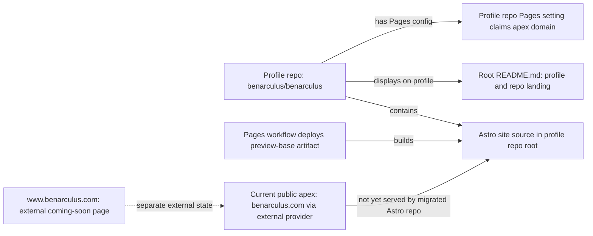
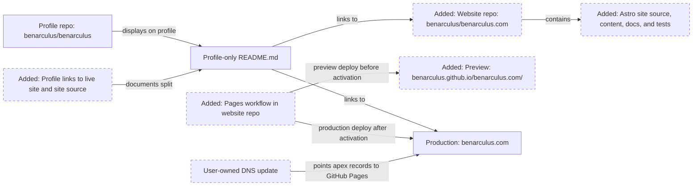
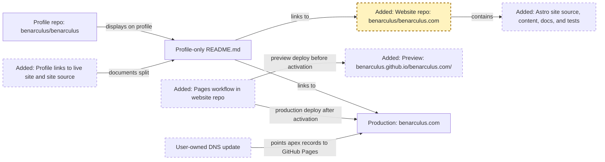
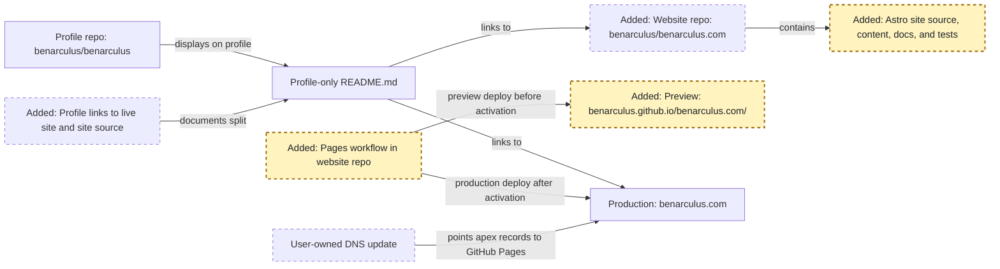
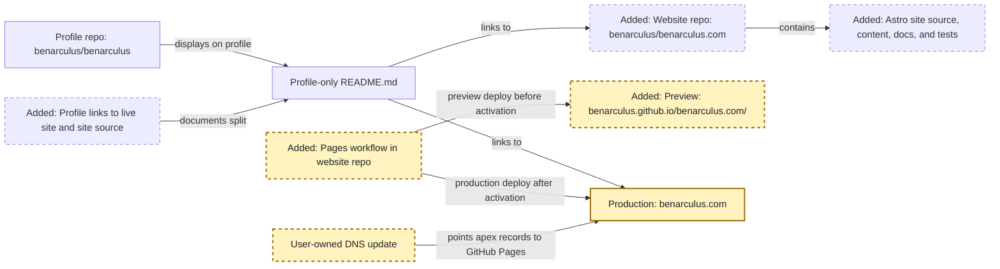
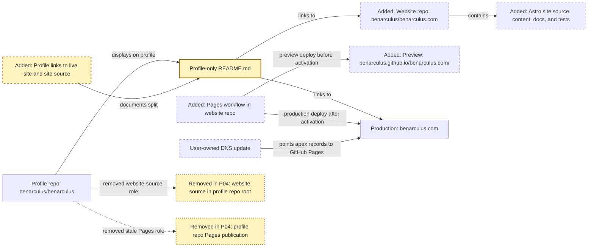

<!-- markdownlint-disable-file -->
# RPI Plan: GitHub profile and Pages blog split

## Task Metadata

* Task ID: RPI-GITHUB-PROFILE-PAGES-BLOG-SPLIT
* Task slug: github-profile-pages-blog
* Plan date: 2026-09-18

## Executive Summary

* Bottom line: Move the Astro/GitHub Pages personal site out of `benarculus/benarculus` and into a new dedicated repository, `benarculus/benarculus.com`, then reduce `benarculus/benarculus` to a concise profile-only README that links to the live site and source repository.
* Why this matters: GitHub always treats the root `README.md` in the public same-name repository as the profile README. A dedicated website repository is the cleanest way to give the GitHub profile and the blog/site independent root READMEs, workflows, documentation, and ownership boundaries.
* Planning result: Complete and implementation-ready after one standard critique. The critique returned `Revise`; all findings were resolved in this plan without rerunning critique.
* Confidence and uncertainty: High confidence in the repository split, selected repository name, apex production hostname, manual DNS ownership, and current Astro/Pages evidence. Residual uncertainty is operational: the implementer must re-check live GitHub Pages settings, DNS state, and destination repository availability immediately before activation.

### What You May Not Know

* `benarculus/benarculus` is special for the profile README but is not a Pages user-site repository. Its current preview path behaves like a project site at `https://benarculus.github.io/benarculus/`.
* `benarculus/benarculus.com` will also be a project-site repository before the custom domain is attached, so its preview URL should be treated as `https://benarculus.github.io/benarculus.com/`.
* The current production-domain baseline is not an Astro site already live on GitHub Pages. The critique found `www.benarculus.com` shows a Squarespace coming-soon page, while the user selected apex `benarculus.com` as canonical. This plan therefore treats P03 as first production activation from the new repository, not a low-downtime transfer of an already-live Astro Pages site.
* DNS-provider changes are user-owned. Implementation prepares exact DNS instructions and pauses for the user to make DNS changes before post-activation verification.

## Phase Checklist

### Before

### After

The change separates the GitHub profile surface from the website source. The profile repository keeps the profile README; the new `benarculus.com` repository owns the Astro project, validation, Pages deployment, and canonical apex production domain.

<!-- rpi:phase id=P01 -->
### [x] P01: Establish destination repository and migration boundary

Goals:
* Establish the target repository, permissions, working-copy boundary, and migration inventory before files move so implementation does not mix profile cleanup with website-source relocation.

Dependencies:
* None.

Highlighted work: create or confirm the `benarculus/benarculus.com` destination and record the migration boundary.

<!-- rpi:task id=P01-T01 -->
#### [x] P01-T01: Create or confirm the dedicated website repository

Goals:
* Make `benarculus/benarculus.com` available as the destination repository for the Astro site and Pages deployment.

Requirements:
* FR-002
* NFR-003
* The repository name is `benarculus.com`; do not substitute `blog`, `site`, or `benarculus.github.io` without a user decision.
* The repository is public unless the implementer records a user-approved reason to use a different visibility.
* The repository purpose is the website/blog source for `https://benarculus.com/`, not the GitHub profile README.

Details:
* If `benarculus/benarculus.com` already exists, inspect it before adding content and preserve unrelated existing work.
* If it does not exist, create it as an empty repository and apply repository settings in later tasks rather than mixing creation with site migration.
* The default Pages preview path implied by the repository name is `https://benarculus.github.io/benarculus.com/`; this path informs P02 and P03 configuration.
* Implementation should open or create a destination working copy for `benarculus/benarculus.com` separately from the current `benarculus/benarculus` workspace. The single authoritative changes record remains `.copilot-tracking/changes/2026-09-18/github-profile-pages-blog-changes.md` in this planning lineage and should reference destination commits, PRs, workflow runs, and live URLs.

References:
* [.copilot-tracking/research/2026-09-18/github-profile-pages-blog-research.md](../../research/2026-09-18/github-profile-pages-blog-research.md):
  * `Decisions and Feedback` records the dedicated website repository direction.

Dependencies:
* None.

<!-- rpi:task id=P01-T02 -->
#### [x] P01-T02: Record the migration boundary and preservation inventory

Goals:
* Define which source, workflow, documentation, and validation assets move to the website repository and which assets remain in the profile repository.

Requirements:
* FR-001
* FR-002
* FR-006
* The website repository migration inventory includes the Astro source, content, public media, package manifests and lockfile, TypeScript/Astro/test configuration, scripts, browser/unit tests, site docs, Pages workflow, Dependabot/CODEOWNERS/security configuration where still applicable, licenses, and content license.
* The profile repository retain list includes only profile-facing README content and repository metadata needed for the profile repository itself.
* The implementation records any destination repository pre-existing files before modifying them.

Details:
* Use the current repository as the source of truth for files that support the site. Preserve file history when practical, but do not let history preservation override correctness or user-approved repository boundaries.
* Keep sensitive data out of both repositories. Existing docs already treat public repository history as publication-ready only.
* Existing `.copilot-tracking/` artifacts are planning evidence, not production website source. Implementation may keep or omit tracking artifacts from the destination based on the repository's tracking policy, but production docs must not cite tracking paths.

References:
* [README.md](../../../README.md): Current profile and repository/source messaging to split.
* [docs/authoring.md](../../../docs/authoring.md): Current authoring and public-repository boundary guidance.
* [src](../../../src): Current Astro source and content.
* [public](../../../public): Current public media assets.
* [tests](../../../tests): Current validation coverage.
* [.github](../../../.github): Current workflow and repository configuration source.

Dependencies:
* P01-T01.

<!-- rpi:phase id=P02 -->
### [x] P02: Move and adapt the Astro site in `benarculus.com`

Goals:
* Re-home the current website implementation in the dedicated repository while preserving site behavior, validation intent, and distinct preview versus production URL semantics.

Dependencies:
* P01.

Highlighted work: add/adapt the site source, workflow, tests, and preview/production configuration in the destination repository.

<!-- rpi:task id=P02-T01 -->
#### [x] P02-T01: Move website source and repository support files

Goals:
* Populate `benarculus/benarculus.com` with the website source and support files needed to build and maintain the current Astro site independently.

Requirements:
* FR-002
* FR-005
* NFR-003
* The destination repository contains all files required to run `npm ci`, local development, validation, and Pages builds for the site.
* The destination repository has website-specific README/docs that explain it is the source for `https://benarculus.com/`.
* No production custom-domain artifact is copied into a preview deployment before P03 activation. With the current custom GitHub Actions publishing source, GitHub does not require a `CNAME` file; if one is introduced later, it must be activation-scoped and deliberate.

Details:
* Move the Astro project as a root-level app in `benarculus/benarculus.com` unless a later user decision chooses a subfolder. The dedicated repository removes the need for `site/` nesting.
* Include `package.json`, `package-lock.json`, `astro.config.mjs`, `tsconfig.json`, `vitest.config.ts`, `playwright.config.ts`, `src/`, `public/`, `scripts/`, `tests/`, site docs, license files, and relevant `.github/` configuration.
* Exclude profile-only messaging from the destination README. Destination README content should describe the website source, local setup, validation, deployment, and links back to the profile repository where useful.

References:
* [package.json](../../../package.json): Current scripts and dependency contract.
* [package-lock.json](../../../package-lock.json): Current deterministic dependency graph.
* [astro.config.mjs](../../../astro.config.mjs): Current static output, production origin, and preview base.
* [src](../../../src): Current Astro pages, components, content, and helpers.
* [public](../../../public): Current public images.
* [scripts](../../../scripts): Current generated-output and Lighthouse utilities.
* [tests](../../../tests): Current unit and browser tests.
* [docs](../../../docs): Current authoring and migration documentation.

Dependencies:
* P01-T02.

<!-- rpi:task id=P02-T02 -->
#### [x] P02-T02: Update destination preview and production URL configuration

Goals:
* Ensure preview builds in the destination repository target the new project-site path while production builds target apex `https://benarculus.com/`.

Requirements:
* FR-003
* FR-005
* NFR-001
* Preview mode uses `https://benarculus.github.io` with base `/benarculus.com`.
* Production mode uses `https://benarculus.com` with base `/`.
* Unit tests and generated-output checks reflect both the selected destination preview URL and apex production URL.

Details:
* Current code uses preview base `/benarculus` and production origin `https://www.benarculus.com`; update destination configuration and tests for `/benarculus.com` and `https://benarculus.com`.
* Preserve the current content routes such as `/blog/` and the existing post permalink while updating hostnames and preview base.
* Treat examples in existing docs that mention `https://benarculus.github.io/benarculus/` or `https://www.benarculus.com/` as outdated after migration and update them in the destination repository.

References:
* [astro.config.mjs](../../../astro.config.mjs): Current `site` and `base` logic.
* [src/lib/site.ts](../../../src/lib/site.ts): Current `SITE.previewBase` and URL helpers.
* [tests/unit/site.test.ts](../../../tests/unit/site.test.ts): Current production and preview URL assertions.
* [scripts/assert-generated.mjs](../../../scripts/assert-generated.mjs): Current generated-output origin logic.
* [docs/authoring.md](../../../docs/authoring.md): Current hosting guidance.

Dependencies:
* P02-T01.

<!-- rpi:task id=P02-T03 -->
#### [x] P02-T03: Adapt destination workflows and repository policy checks

Goals:
* Make validation and Pages deployment run from the destination repository with the same or stronger trust posture as the current workflow, while making the deployed build mode match the served hostname.

Requirements:
* FR-002
* FR-005
* NFR-002
* Preview deployment before custom-domain activation publishes the preview-mode artifact and verifies `npm run test:generated:preview`.
* Production deployment after custom-domain activation publishes the production-mode artifact and verifies `npm run test:generated`.
* Actions used by workflows remain pinned to full commit SHAs.
* Build and deploy jobs keep least-privilege permissions: read-only content access for build and only `pages: write` plus `id-token: write` for deploy.
* The workflow does not use `pull_request_target` for untrusted code validation.

Details:
* Start from the current `.github/workflows/pages.yml` and CI policy rather than creating unrelated deployment mechanics, but do not blindly carry forward `build:preview` as the production deployment command.
* The implementation may use an explicit workflow input, environment variable, branch condition, or activation commit to switch from preview artifact to production artifact. The resulting behavior must be documented and testable.
* Preserve the hidden-file rejection step for the Pages artifact unless implementation evidence shows it is incompatible and a safer equivalent is added.
* Confirm whether repository rulesets, default workflow token permissions, Dependabot, CODEOWNERS, and security policy files should be copied or recreated in the destination repository settings and files.

References:
* [.github/workflows/pages.yml](../../../.github/workflows/pages.yml): Current Pages deployment workflow.
* [.github/workflows/ci.yml](../../../.github/workflows/ci.yml): Current CI workflow.
* [tests/unit/workflow-policy.test.ts](../../../tests/unit/workflow-policy.test.ts): Current workflow trust policy tests.
* [.github/dependabot.yml](../../../.github/dependabot.yml): Current dependency update configuration.
* [.github/CODEOWNERS](../../../.github/CODEOWNERS): Current ownership policy.
* [SECURITY.md](../../../SECURITY.md): Current vulnerability reporting guidance.

Dependencies:
* P02-T01.
* P02-T02.

<!-- rpi:phase id=P03 -->
### [ ] P03: Verify preview and activate apex production domain

Goals:
* Prove the destination repository can build and serve the site at its preview URL, then activate apex `benarculus.com` through an explicit GitHub Pages claim, user-owned DNS update, production-mode deployment, HTTPS enforcement, and live verification.

Dependencies:
* P02.

Highlighted work: verify the destination Pages preview, release/claim the apex custom domain, pause for user DNS changes, and verify production.

<!-- rpi:task id=P03-T01 -->
#### [x] P03-T01: Validate local and GitHub Pages preview behavior

Goals:
* Establish that the migrated destination repository builds, tests, and serves correctly before apex production activation.

Requirements:
* FR-003
* FR-005
* NFR-001
* `npm ci` and the repository validation command pass in `benarculus/benarculus.com`.
* The destination repository Pages preview is reachable at `https://benarculus.github.io/benarculus.com/` before custom-domain activation.
* Generated RSS, sitemap, robots, internal links, assets, canonical metadata, and article paths remain coherent in preview mode.

Details:
* The current validation command is `npm run validate`; preserve or intentionally update it in the destination repository.
* Run preview-targeted generated-output checks before production activation because the preview base changed from `/benarculus` to `/benarculus.com`.
* Do not treat a local build alone as sufficient evidence for apex activation; verify the GitHub Pages-hosted preview.

References:
* [package.json](../../../package.json): Current `validate`, build, and test scripts.
* [tests/browser/site.spec.ts](../../../tests/browser/site.spec.ts): Current browser regression tests.
* [scripts/assert-generated.mjs](../../../scripts/assert-generated.mjs): Current generated-output assertions.
* [.github/workflows/pages.yml](../../../.github/workflows/pages.yml): Current Pages artifact deployment process.

Dependencies:
* P02-T02.
* P02-T03.

<!-- rpi:task id=P03-T02 -->
#### [x] P03-T02: Prepare GitHub Pages apex-domain handoff

Goals:
* Move the GitHub Pages custom-domain claim from the profile repository to the destination repository without relying on DNS changes that the agent cannot perform.

Requirements:
* FR-003
* FR-004
* NFR-001
* NFR-002
* The implementation re-checks the current Pages custom-domain state for `benarculus/benarculus` immediately before activation.
* The profile repository releases any Pages custom-domain claim for `benarculus.com` before the destination repository claims it.
* The destination repository adds `benarculus.com` as its Pages custom domain before the user changes DNS, following GitHub's domain-takeover guidance.
* The destination repository's deployment mode is production-mode before production verification begins.

Details:
* The critique observed the source repo Pages record claiming apex `benarculus.com`; treat that as point-in-time evidence and re-verify during implementation.
* For custom GitHub Actions publishing, GitHub docs state a `CNAME` file is not created and existing `CNAME` files are ignored/not required. Prefer repository Pages settings unless implementation evidence supports a deliberate artifact.
* If GitHub reports that the domain is already claimed, certificate issuance is blocked, or the Pages custom domain cannot be saved, stop and record the exact blocker rather than changing DNS.

References:
* [.copilot-tracking/reviews/plans/2026-09-18/github-profile-pages-blog-plan-critique.md](../../reviews/plans/2026-09-18/github-profile-pages-blog-plan-critique.md): PC-001 through PC-004 identify the corrected baseline and handoff risks.
* GitHub Docs, `Managing a custom domain for your GitHub Pages site`: custom-domain settings should be configured in GitHub before DNS provider changes.
* [astro.config.mjs](../../../astro.config.mjs): Current production origin to update to apex.

Dependencies:
* P03-T01.

<!-- rpi:task id=P03-T03 -->
#### [x] P03-T03: Provide DNS instructions and pause for user-owned DNS update

Goals:
* Give the user exact DNS-provider changes and rollback information, then wait for user completion before production verification.

Requirements:
* FR-004
* NFR-001
* The implementation records current non-sensitive DNS evidence before asking the user to change records.
* The user, not the agent, performs DNS-provider changes unless the user gives a new explicit implementation-time instruction.
* The instructions identify the apex-domain record set GitHub Pages requires at implementation time. At the time of this plan, GitHub documents apex `A` records for `185.199.108.153`, `185.199.109.153`, `185.199.110.153`, and `185.199.111.153`; optional `AAAA` records are documented for IPv6.
* The instructions include rollback guidance to restore the prior provider records if activation fails.

Details:
* If the DNS provider supports `ALIAS` or `ANAME`, implementation may present that option alongside GitHub's documented `A` records, but must not guess provider-specific UI steps.
* Do not store credentials, DNS account screenshots with sensitive data, or secret provider metadata in the repository or tracking artifacts.
* DNS propagation can take time; the implementation should treat propagation as an expected wait state, not as a code failure.

References:
* GitHub Docs, `Managing a custom domain for your GitHub Pages site`: apex domain records and HTTPS enforcement guidance.
* [.copilot-tracking/reviews/plans/2026-09-18/github-profile-pages-blog-plan-critique.md](../../reviews/plans/2026-09-18/github-profile-pages-blog-plan-critique.md): PC-002 records the missing DNS owner/task that this task resolves.

Dependencies:
* P03-T02.

<!-- rpi:task id=P03-T04 -->
#### [ ] P03-T04: Verify production activation, HTTPS, and preserved routes

Goals:
* Confirm that apex `https://benarculus.com/` serves the production-mode Astro site from the destination repository and preserves the user-visible blog surface.

Requirements:
* FR-003
* FR-004
* FR-005
* NFR-001
* NFR-002
* Production-mode generated-output checks pass with apex `https://benarculus.com`.
* Live checks confirm `https://benarculus.com/`, `/blog/`, the existing post permalink, RSS, sitemap, robots, canonical metadata, and key assets resolve from the production domain.
* GitHub Pages HTTPS enforcement is enabled on the destination repository once certificate issuance permits it.
* The implementation records live verification evidence and any accepted residual delay or propagation issue in the changes record.

Details:
* The existing post permalink from current tests is `/blog/generate-clarity-by-establishing-a-writing-practice/`; use it as a minimum live permalink check unless content has intentionally changed.
* The production deployment must not serve preview-base `/benarculus.com/` asset URLs or `https://benarculus.github.io` canonical/RSS/sitemap origins.
* If the non-canonical `www` hostname remains externally served or parked, record it as a follow-up unless the user expands scope to configure `www` redirect behavior.

References:
* [scripts/assert-generated.mjs](../../../scripts/assert-generated.mjs): Current production and preview generated-output assertions to update.
* [tests/unit/site.test.ts](../../../tests/unit/site.test.ts): Current URL helper assertions to update.
* [.copilot-tracking/reviews/plans/2026-09-18/github-profile-pages-blog-plan-critique.md](../../reviews/plans/2026-09-18/github-profile-pages-blog-plan-critique.md): PC-003, PC-008, and PC-009 identify production-build and verification gaps.

Dependencies:
* P03-T03.

<!-- rpi:phase id=P04 -->
### [ ] P04: Simplify the profile repository and finalize the split

Goals:
* Remove website-source and Pages-serving responsibility from `benarculus/benarculus`, leave a clean profile README, and document the new source-of-truth relationship.

Dependencies:
* P03.

Highlighted work: profile README cleanup, source links, removal of website source, and disabling/removing stale Pages publication from the profile repository.

<!-- rpi:task id=P04-T01 -->
#### [ ] P04-T01: Replace profile repository content with profile-only scope

Goals:
* Make `benarculus/benarculus` clearly profile-only after the website source and production activation are safely established elsewhere.

Requirements:
* FR-001
* FR-006
* NFR-003
* The root `README.md` remains non-empty, profile-focused, and suitable for GitHub profile display.
* The README links to `https://benarculus.com/`, `/blog/`, and `github.com/benarculus/benarculus.com` as the website source repository.
* Website source files are removed from the profile repository only after P03 activation or an explicitly approved staged migration path.
* The profile repository no longer publishes the old website through GitHub Pages; remove or disable the Pages workflow/settings that would keep serving stale site artifacts from `benarculus/benarculus`.

Details:
* Keep the profile README concise. Do not move website implementation documentation into it.
* If the profile repository keeps lightweight docs, they should explain the profile repository's purpose rather than duplicate site authoring docs.
* Avoid deleting site source from the profile repository until the destination repository is validated and production activation has a recorded result.

References:
* [README.md](../../../README.md): Current profile README to simplify.
* [.github/workflows/pages.yml](../../../.github/workflows/pages.yml): Current Pages workflow to remove or disable from the profile repository after activation.
* [.copilot-tracking/research/2026-09-18/github-profile-pages-blog-research.md](../../research/2026-09-18/github-profile-pages-blog-research.md):
  * `Findings` explains the profile README constraint.
* [.copilot-tracking/reviews/plans/2026-09-18/github-profile-pages-blog-plan-critique.md](../../reviews/plans/2026-09-18/github-profile-pages-blog-plan-critique.md): PC-006 records the stale duplicate Pages risk.

Dependencies:
* P03-T04.

<!-- rpi:task id=P04-T02 -->
#### [ ] P04-T02: Finalize cross-repository documentation and validation evidence

Goals:
* Leave both repositories understandable and auditable after the split.

Requirements:
* FR-005
* FR-006
* NFR-002
* NFR-003
* The destination repository documents local setup, authoring, validation, deployment, apex-domain activation, DNS handoff, and recovery.
* The profile repository documents that website source lives in `benarculus/benarculus.com`.
* `.copilot-tracking/changes/2026-09-18/github-profile-pages-blog-changes.md` remains the single authoritative implementation evidence artifact for this RPI run and references destination repository commits, PRs, workflow runs, Pages settings evidence, DNS instructions, user DNS confirmation, live URLs, and residual risks.
* Any mirrored implementation notes in the destination repository must not replace the authoritative changes record.

Details:
* Record validation in the destination repository and summarize it in the authoritative changes record.
* If a follow-up item is discovered that is not required for the split, keep it out of the active phase checklist and record it separately.
* Do not cite `.copilot-tracking/` artifacts in production website docs or profile README content.

References:
* [docs/authoring.md](../../../docs/authoring.md): Current authoring, validation, hosting, and recovery documentation to adapt for the destination.
* [.copilot-tracking/research/2026-09-18/github-profile-pages-blog-research.md](../../research/2026-09-18/github-profile-pages-blog-research.md): Evidence source for repository split and risks.
* [.copilot-tracking/reviews/plans/2026-09-18/github-profile-pages-blog-plan-critique.md](../../reviews/plans/2026-09-18/github-profile-pages-blog-plan-critique.md): PC-007 records the cross-repository evidence boundary that this task resolves.

Dependencies:
* P04-T01.

## User Decisions and Requirements

### Confirmed User Direction

* Split profile and website concerns by keeping `benarculus/benarculus` as a small profile-only repository.
* Move the Astro/GitHub Pages blog/site to a dedicated website repository rather than keeping it in the profile repository root or a `site/` subfolder.
* Use `benarculus/benarculus.com` as the dedicated website repository name.
* Use apex `https://benarculus.com/` as the canonical production hostname after the split.
* DNS-provider changes are user-owned/manual during implementation; the agent prepares exact instructions and waits for confirmation.
* Preserve `/blog/`, existing content behavior, and current Astro/GitHub Pages validation intent.
* Do not implement production changes during planning.

### Planning Decisions and Feedback

| Group | Decision or feedback item | Status | Owner | Rationale or input needed | Evidence | Planning impact |
|-------|---------------------------|--------|-------|---------------------------|----------|-----------------|
| D1 | Exact dedicated website repository name | Confirmed: `benarculus/benarculus.com` | User | User considered `benarculus/blog` but chose `benarculus.com`; this better frames the destination as the whole personal site and blog source. | Research D1; user answer 2026-09-18 | Final plan uses `benarculus.com`, preview `/benarculus.com`, and the destination repository `github.com/benarculus/benarculus.com`. |
| D2 | Canonical production hostname | Confirmed: apex `benarculus.com` | User | Critique found the draft's `www` baseline was wrong; user selected apex as canonical. | PC-001, PC-005; user answer 2026-09-18 | Production origin, tests, docs, DNS instructions, and live verification target apex `https://benarculus.com/`. |
| D3 | DNS-provider change owner | Confirmed: user-owned manual DNS changes | User | User will make DNS changes manually when implementation identifies exact records. | PC-002; user answer 2026-09-18 | P03 includes a DNS-instruction pause and does not require the agent to access the DNS provider. |

## Planning Readiness and Next Step

| Field | Record |
|-------|--------|
| Planning execution and readiness | Complete; Ready for implementation after critique-driven revisions |
| Decision participation | user-owned; standalone `/hve-core:rpi-plan` invocation |
| Planning delegation | adaptive; default provenance; parent planned inline because phases are tightly coupled and evidence is compact |
| Blockers | None |
| Latest critique | [.copilot-tracking/reviews/plans/2026-09-18/github-profile-pages-blog-plan-critique.md](../../reviews/plans/2026-09-18/github-profile-pages-blog-plan-critique.md) with `Revise`; all findings disposed in this plan |
| Relevant research | [.copilot-tracking/research/2026-09-18/github-profile-pages-blog-research.md](../../research/2026-09-18/github-profile-pages-blog-research.md) |
| Plan | `.copilot-tracking/plans/2026-09-18/github-profile-pages-blog-plan.md` |
| Changes-record role | `.copilot-tracking/changes/2026-09-18/github-profile-pages-blog-changes.md` is implementation evidence |
| Continuation owner | user |
| Required gates or confirmations | Planning critique gate consumed and resolved; implementation must pause for user DNS confirmation at P03-T03 |
| Next action | Run `/rpi-implement` with `.copilot-tracking/changes/2026-09-18/github-profile-pages-blog-changes.md` as the changes record |

## Goals

* Establish a clean long-term ownership boundary where the profile repository presents Ben's GitHub profile and `benarculus/benarculus.com` owns the blog/site source, Pages workflow, and site documentation.
* Preserve the current Astro static-site behavior, content model, security posture, and deployment validation while relocating the site to the dedicated repository.
* Activate apex `https://benarculus.com/` from the destination repository through a preview-first, user-owned DNS sequence.
* Make both repositories self-explanatory to future readers and implementation agents.

## Scope and Non-Goals

### In Scope

* Planning repository split work for `benarculus/benarculus` and `benarculus/benarculus.com`.
* Planning file movement, workflow/settings migration, documentation updates, validation, preview verification, user-owned DNS handoff, production activation, and profile repository cleanup.
* Planning profile repository cleanup so root `README.md` remains profile-focused and points to the apex site and site source repository.

### Non-Goals

* Implementing file moves, repository creation, DNS changes, Pages setting changes, commits, or pull requests during planning.
* Changing the visual design, content model, or blog feature set beyond what is needed for the repository split.
* Migrating private drafts or private DNS/provider credentials into Git history.
* Replacing Astro or GitHub Pages with another framework/host.
* Configuring `www.benarculus.com` redirect behavior in this plan; it is a follow-up unless the user expands implementation scope.

## Functional Requirements

* FR-001: The profile repository remains public, named `benarculus`, and has a concise root `README.md` suitable for GitHub profile display.
* FR-002: The dedicated website repository `benarculus/benarculus.com` contains the Astro site source, content, media, tests, docs, package manifests, and Pages deployment workflow needed to build the current site.
* FR-003: The website repository deployment preserves canonical production `https://benarculus.com/` behavior and provides a verified pre-activation preview at `https://benarculus.github.io/benarculus.com/`.
* FR-004: The migration includes a safe apex custom-domain activation sequence with GitHub Pages claim handoff, user-owned DNS instructions, user confirmation, and verification before declaring production complete.
* FR-005: The implementation preserves current validation intent, including formatting/type checks, unit tests, production build, generated-output checks, browser tests, live route checks, and workflow policy checks.
* FR-006: Repository documentation clearly separates profile-facing content from website source/authoring/operations content.

## Non-Functional Requirements

* NFR-001: Minimize public-site disruption during repository and Pages/custom-domain activation.
  * Objective threshold or evaluation condition: Do not declare `benarculus.com` activated until the dedicated repository's Pages preview, production-mode artifact, DNS state, HTTPS state, and live route checks are verified or a rollback path is recorded.
* NFR-002: Preserve workflow and Pages security posture.
  * Objective threshold or evaluation condition: Actions remain pinned to full commit SHAs, build and deploy permissions remain least-privilege, no personal access token or production secret is required for ordinary Pages deployment, and Pages HTTPS enforcement is enabled once GitHub allows it.
* NFR-003: Maintain source clarity.
  * Objective threshold or evaluation condition: A reader visiting either repository can tell whether it is profile-only or website-source without reading implementation history.

## Risks and Open Questions

| Priority | Type | Risk, question, or planning item | Affected work | Impact | Smallest action or evidence needed | Owner |
|----------|------|----------------------------------|---------------|--------|------------------------------------|-------|
| H | risk | Pages custom-domain handoff or user-owned DNS change can fail or take time to propagate. | P03-T02, P03-T03, P03-T04 | Production activation may be delayed or require rollback. | Re-check live Pages/DNS state, record prior records, provide exact DNS instructions, and verify after user confirmation. | downstream/user |
| M | risk | Moving repository files may break tests, package cache, relative paths, or workflow assumptions. | P02-T01, P02-T02, P02-T03, P03-T01 | CI/deploy failure after migration. | Changed-area and full validation in the dedicated repository. | downstream |
| M | risk | Existing destination repository content could exist under `benarculus/benarculus.com`. | P01-T01, P02-T01 | Accidental overwrite or merge conflict. | Inspect destination repo before writing and preserve unrelated work. | downstream |
| M | follow-up | `www.benarculus.com` behavior is outside active scope after user selected apex canonical hostname. | Follow-up | Visitors using `www` may continue seeing the current external coming-soon page until redirect handling is planned. | Decide later whether to configure `www` CNAME redirect to apex. | user |
| L | open question | Whether to preserve detailed git history during cross-repository migration. | P02-T01 | Affects implementation mechanics, not target behavior. | Implementer may use a safe history-preserving method when practical, or record why a clean import was chosen. | downstream |

## Dependencies

* GitHub repository permissions: Implementation needs authority to create/configure `benarculus/benarculus.com` and update `benarculus/benarculus`.
* DNS/custom-domain owner access: The user will perform DNS provider changes at P03-T03 after receiving exact instructions.
* Current site validation baseline: Implementation should preserve or update the current `npm run validate` contract in the destination repository.
* GitHub Pages availability and settings: Implementation must verify live Pages settings before apex activation.

## Sources

* [.copilot-tracking/research/2026-09-18/github-profile-pages-blog-research.md](../../research/2026-09-18/github-profile-pages-blog-research.md): Primary evidence and confirmed selection of the dedicated website repository direction.
* [.copilot-tracking/reviews/plans/2026-09-18/github-profile-pages-blog-plan-critique.md](../../reviews/plans/2026-09-18/github-profile-pages-blog-plan-critique.md): Standard critique findings and revision drivers.
* [README.md](../../../README.md): Current profile-facing root README and current repository/site messaging.
* [.github/workflows/pages.yml](../../../.github/workflows/pages.yml): Current Pages build and deployment workflow.
* [.github/workflows/ci.yml](../../../.github/workflows/ci.yml): Current CI workflow.
* [package.json](../../../package.json): Current scripts and dependency contract.
* [astro.config.mjs](../../../astro.config.mjs): Current production and preview site/base configuration.
* [src/lib/site.ts](../../../src/lib/site.ts): Current site constants and URL helpers.
* [scripts/assert-generated.mjs](../../../scripts/assert-generated.mjs): Current generated-output assertions.
* [docs/authoring.md](../../../docs/authoring.md): Current authoring, validation, public repository, and hosting guidance.
* [tests](../../../tests): Current unit and browser validation coverage.
* GitHub Docs, `Managing a custom domain for your GitHub Pages site`: apex custom-domain records, GitHub-before-DNS guidance, and HTTPS enforcement timing.

## Critique Disposition

* Critique candidate identity: RPI-GITHUB-PROFILE-PAGES-BLOG-SPLIT final candidate saved before reservation; SHA-256 `d2ce8dae9d13804aa74c7989573c1ee28fd5d04c39a16a74866cc59a24eeced1`
* Critique depth and provenance: standard; default
* Critique execution: complete
* Initial attempt consumed: yes
* Recovery attempt consumed: no
* Attempt provenance: initial attempt `PCG-2026-09-18-001`; kind `initial`; candidate boundary was saved plan content before reservation metadata with SHA-256 `d2ce8dae9d13804aa74c7989573c1ee28fd5d04c39a16a74866cc59a24eeced1`; output `.copilot-tracking/reviews/plans/2026-09-18/github-profile-pages-blog-plan-critique.md`; verdict `Revise`.
* Recovery eligibility and consent: not applicable; terminal critique result consumed the gate and was not retried.

| Critique run and finding | Disposition | Action owner | Exact resolving evidence | Decision route | Plan response or residual risk |
|--------------------------|-------------|--------------|--------------------------|----------------|--------------------------------|
| PC-001 false production baseline | resolved | planning parent and user | Executive Summary, Before diagram, P03 goals/tasks, NFR-001, D2 | user decision plus direct correction | Reframed from low-downtime Astro cutover to first production activation from destination; user selected apex `benarculus.com`. |
| PC-002 missing DNS owner/task | resolved | user and downstream implementation | D3, P03-T03, Dependencies | user decision plus direct correction | DNS provider changes are user-owned/manual; implementation prepares exact records and waits for confirmation. |
| PC-003 preview artifact would be deployed to production | resolved | planning parent | P02-T03, P03-T04, FR-005 | direct correction | Workflow requirements distinguish preview artifact before activation from production artifact after activation. |
| PC-004 custom-domain claim handoff and `CNAME` sequencing gap | resolved | planning parent | P02-T01, P03-T02 | direct correction | Plan excludes pre-activation custom-domain artifacts and owns release/claim sequence in P03-T02. |
| PC-005 apex vs `www` contradiction | resolved | user | D2, FR-003, P02-T02, P03-T04 | user decision | Apex `benarculus.com` is canonical; `www` redirect behavior moved to follow-up. |
| PC-006 stale duplicate site from profile repo Pages | resolved | planning parent | P04-T01 | direct correction | Profile repo Pages publication must be removed or disabled after activation. |
| PC-007 cross-repository handoff ambiguity | resolved | planning parent | P01-T01, P04-T02, Planning Readiness | direct correction | Destination working copy is separate; this lineage's changes record remains authoritative and references destination evidence. |
| PC-008 missing production route verification | resolved | planning parent | P03-T04, FR-005 | direct correction | Post-activation verification includes production generated output, `/blog/`, article permalink, RSS, sitemap, HTTPS, and assets. |
| PC-009 HTTPS enforcement missing | resolved | planning parent | NFR-002, P03-T04 | direct correction | Destination Pages HTTPS enforcement is required once certificate issuance permits it. |

## Artifact Self-Check

* [x] Executive Summary, What You May Not Know, and the Phase Checklist come first and are understandable without reading the supporting sections.
* [x] Confirmed direction, grouped decisions, readiness, goals, scope, requirements, risks, and dependencies are current and consistent with the Phase Checklist.
* [x] Planning decision participation and provenance are recorded; user-owned and user-retained groups have persisted answers, while agent-owned groups have evidence-backed rationales or honest blockers.
* [x] Planning delegation and provenance are recorded; adaptive, never, or always behavior was followed without overriding phase boundaries.
* [x] Functional and non-functional requirements are current, and every `FR-nnn` and `NFR-nnn` is cited by at least one task's Requirements.
* [x] Every `Pxx` has Goals, Dependencies, and a phase diagram that highlights its part of After with any labeled removal context. Every `Pxx-Txx` has Goals, Requirements, Details, References, and Dependencies.
* [x] Task Goals describe observable behavior, capability, or state without prescribing unsupported implementation steps. Details and References ground the implementer; examples are illustrative unless a requirement or contract makes them binding.
* [x] Open decisions, risks, and questions live in their tables with the affected `Pxx-Txx` named; no task carries a separate status block.
* [x] Code, commands, and symbols use `backticks`. Existing files and folders are Markdown links whose text is the workspace-relative path and whose destination resolves from this plan file.
* [x] Before reflects the evidence-backed pre-change baseline; After reflects the intended result of all phases. Corresponding elements and phase diagrams reuse stable node IDs, with added and removed work distinguishable without color.
* [x] Every emitted initialization object has the prescribed string values for themeVariables.fontFamily and themeVariables.fontSize. All diagrams use theme-aware styling, with explicit text colors on custom fills. Dual-theme rendering was not visually verified in both themes during planning; source styling follows the reference.
* [x] Risks, open questions, blockers, critique findings, and accepted residual risks have owners and next actions.
* [x] Critique depth, attempt provenance and current-dispatch ownership are recorded; terminal result was not retried, and all findings are disposed without a closure critique.
* [x] Planning execution, readiness, continuation owner, gates, next action, and implementation paths are complete and consistent.
* [x] Follow-Up Items remain outside active plan completion and acceptance claims.
* Checked sections: All sections after critique-driven revision.
* Missing or limited sections: Dual-theme Mermaid rendering was not visually verified; implementation must re-check live DNS and Pages state because critique live probes were point-in-time.

## Follow-Up Items

* Decide whether to configure `www.benarculus.com` as a redirect to apex `benarculus.com`. This is outside immediate scope because the user selected apex canonical rather than "use both"; owner: user/downstream planning.

## Handoff

* Authoritative implementation handoff: Planning Readiness and Next Step.
* Standalone next command: `/rpi-implement`
* Changes-record path for implementation evidence: `.copilot-tracking/changes/2026-09-18/github-profile-pages-blog-changes.md`
